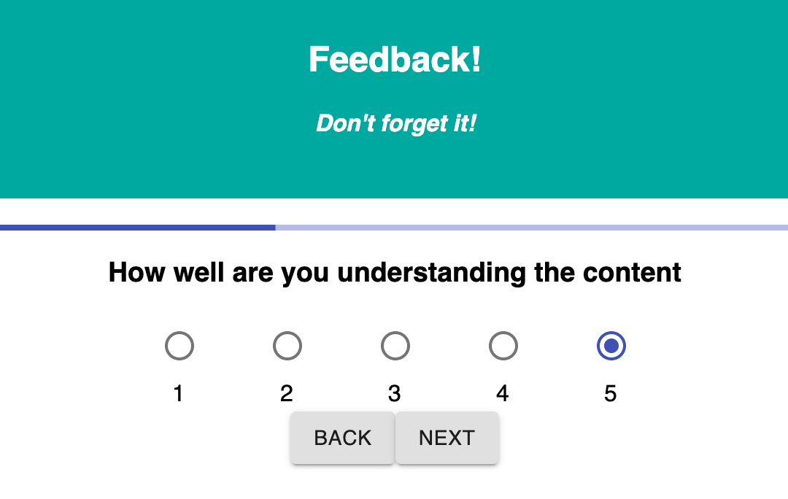
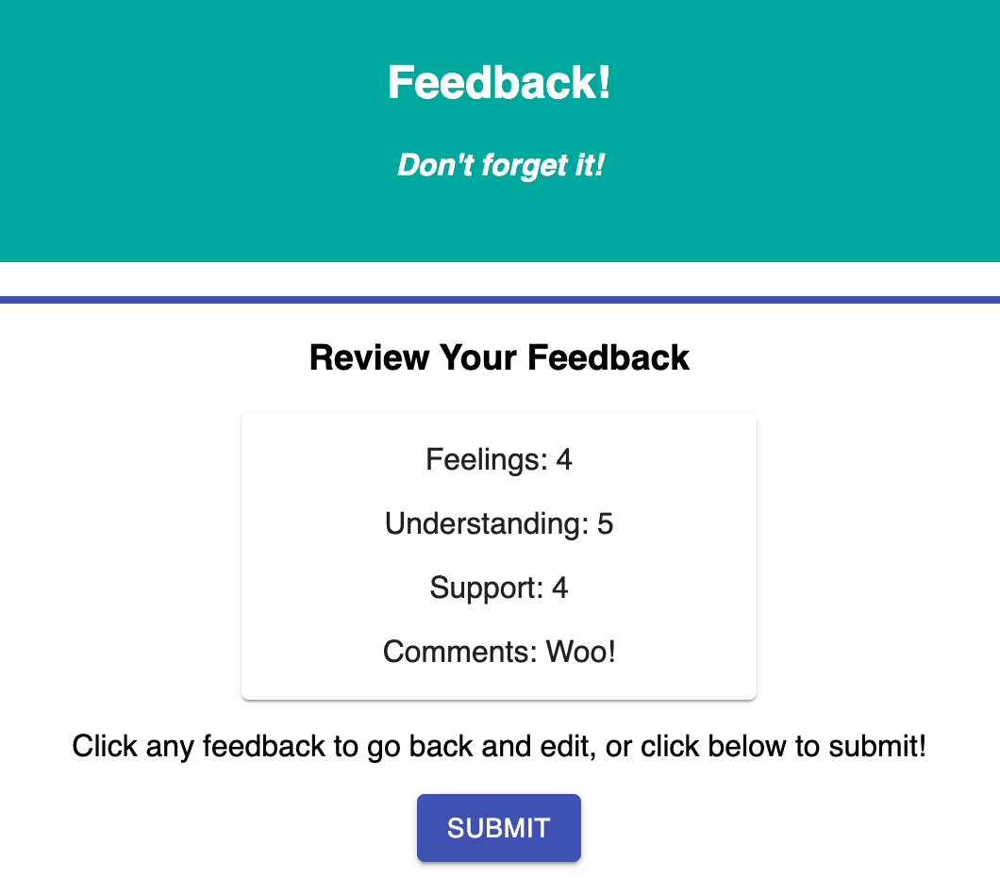

# Feedback Form
## Description

This lightweight React app is designed to collect feedback information in a streamlined manner and store it in a database.  Material UI provides a crisp interface, and the logic under the hood allows user flexibility.  All responses are editable in any step of the submission process - up until submit!

Future iterations of this application could include an Admin mode that views and manages all of the saved feedback in the database.

## Setup

Create your database and tables using the provided `data.sql` file. Start the server.

```
npm install
npm run server
```

Now that the server is running, open a new terminal tab with `cmd + t` and start the react client app.

```
npm run client
```

## Screen Shots





## Built With

- Javascript
- React.js/Redux
- node.js
- express
- PostgreSQL

## Acknowledgement

Thanks to all the cool beans in the Rabin cohort at Prime!

## Developer's Notes

Mad respect to the Material-UI mavens of the world.  Buildng a nice looking webpage is tough!

Also, "back" buttons are harder than they should be.

## Support

If you have issues or suggestions, please email me at [dewitt.kane@gmail.com].